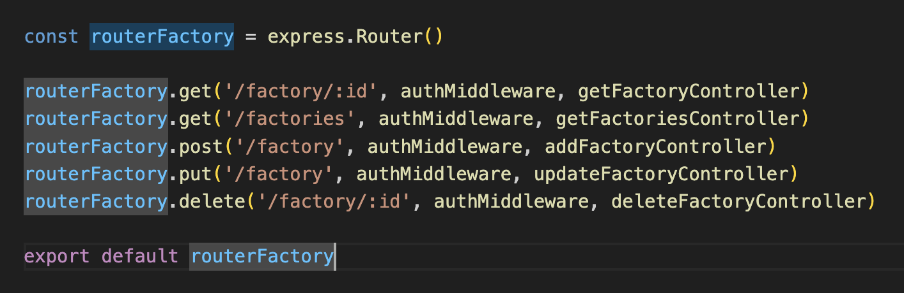
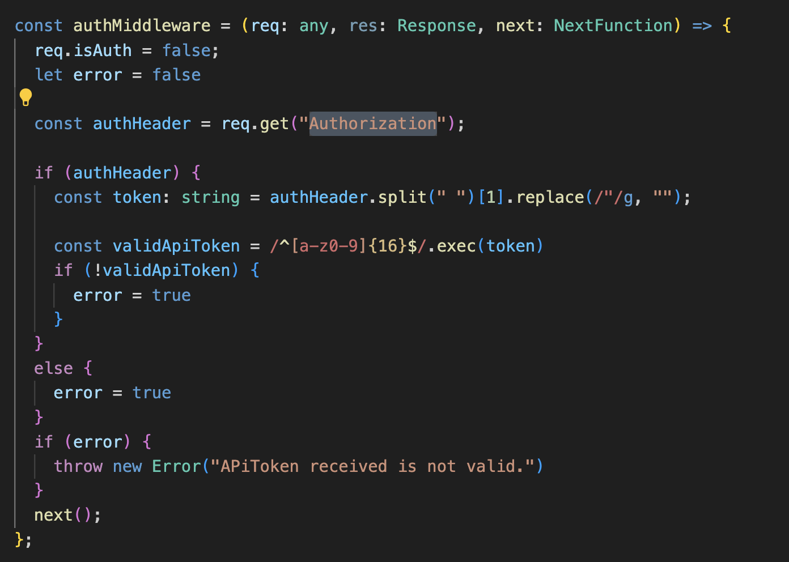
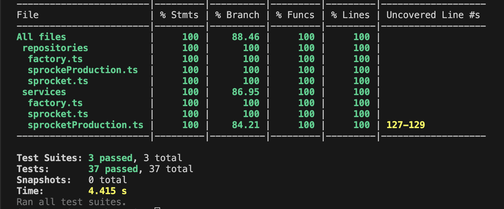

# Power Flex Backend REST API

This project was bootstrapped with:
* [Node](https://nodejs.org/en)
* [Express](https://expressjs.com/es/)
* [Typescript](https://www.typescriptlang.org/)
* [Prisma](https://www.prisma.io/)
* [Jest](https://jestjs.io/)
* [Docker](https://www.docker.com/)
* [SQL Server](https://learn.microsoft.com/en-us/sql/linux/quickstart-install-connect-docker?view=sql-server-ver16&tabs=cli&pivots=cs1-bash)


## API Design

The REST API has the following layers:

1. Routes: Define the path pattern for every capability.


2. Middleware: Intermediary middleware who validate the presence of the API Token, for allow the request to be executed.



3. Controllers: Entrypoint to the API, this layer receive the parameters of the request and validate, required parameters presence and types. 

4. Services: Handles all the business logic and relays on the repository layer for persisting the state.

5. Repository: Use Prisma as ORM to connect with the data base.

This REST API, offer capabilities for:

1. CRUD Factories

    * Create
    
        ```
            curl --location 'http://localhost:5000/factory' \
                --header 'Authorization: APIToken aeb46ef25b573cd2' \
                --header 'Content-Type: application/x-www-form-urlencoded' \
                --data-urlencode 'name=fab1'
        ``` 
    * Update
    
        ```
            curl --location --request PUT 'http://localhost:5000/factory' \
                --header 'Authorization: APIToken aeb46ef25b573cd2' \
                --header 'Content-Type: application/x-www-form-urlencoded' \
                --data-urlencode 'name=fab1234890' \
                --data-urlencode 'id=4'
        ``` 
    * Delete
    
        ```
            curl --location --request DELETE 'http://localhost:5000/factory/3' \
            --header 'Authorization: APIToken aeb46ef25b573cd2'
        ``` 
    * Get Single
    
        ```
            curl --location 'http://localhost:5000/factory/4' \
            --header 'Authorization: APIToken aeb46ef25b573cd2'
        ``` 
    * Get All
    
        ```
            curl --location 'http://localhost:5000/factories?page=0&size=10' \
            --header 'Authorization: APIToken aeb46ef25b573cd2'
        ``` 
2. CRUD SpRockets

    * Create
    
        ```
            curl --location 'http://localhost:5000/sprocket' \
                --header 'Authorization: APIToken aeb46ef25b573cd2' \
                --header 'Content-Type: application/x-www-form-urlencoded' \
                --data-urlencode 'pitchDiameter=2' \
                --data-urlencode 'teeth=2' \
                --data-urlencode 'outsideDiameter=2' \
                --data-urlencode 'pitch=2'
        ``` 
    * Update
    
        ```
            curl --location --request PUT 'http://localhost:5000/sprocket' \
                --header 'Authorization: APIToken aeb46ef25b573cd2' \
                --header 'Content-Type: application/x-www-form-urlencoded' \
                --data-urlencode 'pitchDiameter=2' \
                --data-urlencode 'id=10' \
                --data-urlencode 'teeth=2' \
                --data-urlencode 'outsideDiameter=2' \
                --data-urlencode 'pitch=2'
        ``` 
    * Delete
    
        ```
            curl --location --request DELETE 'http://localhost:5000/sprocket/1t' \
                --header 'Authorization: APIToken aeb46ef25b573cd2'
        ``` 
    * Get Single
    
        ```
            curl --location 'http://localhost:5000/sprocket/3?=null' \
                --header 'Authorization: APIToken aeb46ef25b573cd2'
        ``` 
    * Get All
    
        ```
            curl --location 'http://localhost:5000/sprockets?page=0&size=10' \
                --header 'Authorization: APIToken aeb46ef25b573cd2'
        ``` 
3. CRUS SpRockets Factory Production.
    * Create
    
        ```
            curl --location 'http://localhost:5000/sprocketproduction' \
                --header 'Authorization: APIToken aeb46ef25b573cd2' \
                --header 'Content-Type: application/x-www-form-urlencoded' \
                --data-urlencode 'factoryId=4' \
                --data-urlencode 'sprocketId=3' \
                --data-urlencode 'goal=11' \
                --data-urlencode 'actual=6' \
                --data-urlencode 'time=1718603750712'
        ``` 
    * Update
    
        ```
            curl --location --request PUT 'http://localhost:5000/sprocketproduction' \
                --header 'Authorization: APIToken aeb46ef25b573cd2' \
                --header 'Content-Type: application/x-www-form-urlencoded' \
                --data-urlencode 'id=fab1234' \
                --data-urlencode 'factoryId=3' \
                --data-urlencode 'sprocketId=' \
                --data-urlencode 'goal=' \
                --data-urlencode 'actual=' \
                --data-urlencode 'time='
        ``` 
    * Delete
    
        ```
            curl --location --request DELETE 'http://localhost:5000/sprocketproduction/6' \
                --header 'Authorization: APIToken aeb46ef25b573cd2'
        ``` 
    * Get Single
    
        ```
            curl --location 'http://localhost:5000/sprocketproduction/30' \
                --header 'Authorization: APIToken aeb46ef25b573cd2'
        ``` 
    * Get All
    
        ```
            curl --location 'http://localhost:5000/sprocketsproduction?page=0&size=10' \
                --header 'Authorization: APIToken aeb46ef25b573cd2'
        ```
        
    * Get By Factory
    
        ```
            curl --location 'http://localhost:5000/sprocketsproduction/2?page=0&size=10' \
                --header 'Authorization: APIToken aeb46ef25b573cd2'
        ``` 
To test this endpoint, you can use the [Postman Collection](/api/postman/PowerFlex.postman_collection.json)

All the response from the REST API use the json format.

```
        {
            "factories": [
                {
                    "factory": {
                        "name": "fab1",
                        "spRocketId": 1,
                        "char_data": {
                            "sprocket_production_actual": [
                                6,
                                7,
                                5
                            ],
                            "sprocket_production_goal": [
                                11,
                                12,
                                8
                            ],
                            "time": [
                                1718603750712,
                                1718603750713,
                                1718603750722
                            ]
                        }
                    }
                },
                {
                    "factory": {
                        "name": "fab1",
                        "spRocketId": 2,
                        "char_data": {
                            "sprocket_production_actual": [
                                33,
                                22
                            ],
                            "sprocket_production_goal": [
                                34,
                                22
                            ],
                            "time": [
                                1718603761722,
                                1718603761740
                            ]
                        }
                    }
                }
            ]
        }
        ```

## Run the REST API

The simplest way to run this API, is using [docker-compose](/docker-compose.yaml). This will spawn the following containers:

* mssql: A Microsoft Sql Server DB which is used to persist all the factory, sprockets and production data.

* mssql-tools: A script that create the DB powerflex on the Sql Server Instance.

* api: This is the Rest API which will be exposed on port 5000.

### Start the containers

Use the following command:

```
    docker-compose up -d
```

### Stop the containers

Use the following command:

```
    docker-compose down
```
## API Security

To not implement a signup/signin module, we decide to use an API Token to have a dummy authentication mechanism. This is just for the purpose of adding a dummy layer of security to depict how to handle validation of any of the request.

For this purpose, every route has a middleware that is execute before the feature called, to guarantee that the request is from a legitime user.

## Testing Coverage

This project use Jest as testing framework for unit testing all the service and repository layers.




